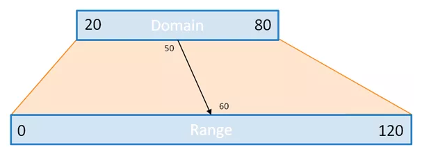

#JS Session 3

##Drawing with SVGs

Run a server and view `index.html` in a browser

######The SVG element and [all that goes into it](https://developer.mozilla.org/en-US/docs/Web/SVG/Element)

######[Basic shapes](https://www.dashingd3js.com/svg-basic-shapes-and-d3js)

######[Scales](http://www.jeromecukier.net/blog/2011/08/11/d3-scales-and-color/)

Simply put: scales transform a number in a certain interval (called the domain) into a number in another interval (called the range).

######Axes

######Margins
Mike Bostock's margin convention: http://bl.ocks.org/mbostock/3019563.