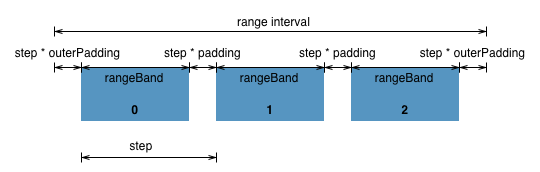

#JS Session 4

##Charting basics

Run a server and view `index.html` in a browser

 

### Formating numbers
Formatting numbers is one of those things you don't normally think about until an ugly "0.30000000000000004" appears on your axis labels. Also, maybe you want to group thousands to improve readability, and use fixed precision, such as "$1,240.10". Or, maybe you want to display only the significant digits of a particular number. D3 makes this easy using a standard number format.
 
[Documentation](https://github.com/mbostock/d3/wiki/Formatting)

[D3.format tutorial through examples](http://koaning.s3-website-us-west-2.amazonaws.com/html/d3format.html)

### Using the accessor function when loading data
Values always load from CSVs (or TSVs) as strings. They will not be automatically converted to numbers. By specifying an accessor function, you can convert the strings to numbers or other specific types.

[Documentation](https://github.com/mbostock/d3/wiki/CSV#parse)

### Scales
Scales are functions that map from an input domain to an output range. Ordinal scales have a discrete domain, such as a set of names or categories. There are also quantitative scales, which have a continuous domain, such as the set of real numbers.
#### rangebands
A [D3 ordinal scale function](https://github.com/mbostock/d3/wiki/Ordinal-Scales#ordinal_rangeBands ) that subdivides an innterval into n evenly-spaced bands, where n is the number of (unique) values in the input domain.

##### rangeRoundBands
Like rangeBands, except guarantees that range values and band width are integers so as to avoid antialiasing artifacts.

