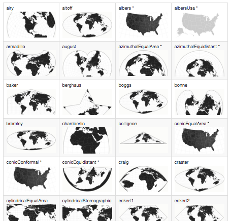

#JS Session 8

## Maps Maps Maps
 

### GeoJSON & TopoJSON
[GeoJSON](https://en.wikipedia.org/wiki/GeoJSON) is an open standard format designed for representing simple geographical features, along with their non-spatial attributes, based on JavaScript Object Notation.

[TopoJSON](https://en.wikipedia.org/wiki/GeoJSON#TopoJSON) is an extension of GeoJSON that encodes topology. Rather than representing geometries discretely, geometries in TopoJSON files are stitched together from shared line segments called arcs. Arcs are sequences of points, while line strings and polygons are defined as sequences of arcs. Each arc is defined only once, but can be referenced several times by different shapes, thus reducing redundancy and decreasing the file size.

To use TopoJSON with d3, you need the [extension file](https://cdnjs.cloudflare.com/ajax/libs/topojson/1.6.20/topojson.min.js) included as a link in your HTML.

	 
	 

##### Making or finding TopoJSON files

Using commandline tools, you can take conventional [shapefiles](https://en.wikipedia.org/wiki/Shapefile) and convert them into GeoJSON and then into TopoJSON. A good sorce for shapefiles is [Natural Earth](http://www.naturalearthdata.com/downloads/), which even let's you choose the level of resolution, so you can reduce file-size.

A very good walk through on how to go from shapefiles to a map, is Mike Bostock's [Let's Make a Map](https://bost.ocks.org/mike/map/) or [Let's Make a Bubble Map](https://bost.ocks.org/mike/bubble-map/).

Othrwise, you can find existing examples and use the associted json files. [Bostock's bl.ocks](http://bl.ocks.org/mbostock) has a wide array of map examples. Here's some links to the TopoJSON files he uses:

* [U.S. with states and counties](http://bl.ocks.org/mbostock/raw/4090846/us.json)
* [World with countries 110m](http://bl.ocks.org/mbostock/raw/4090846/world-110m.json)
* [World with countries 50m](http://bl.ocks.org/mbostock/raw/4090846/world-50m.json)

##### Binding data to features

To keep TopoJSON files simple and uniform, universal codes are used as for the id of a given feature, such as: countries are distinguished by their [ISO numeric 3 digit code](https://en.wikipedia.org/wiki/ISO_3166-1), U.S. states by their [FIPS numeric 2 digit code](https://en.wikipedia.org/wiki/Federal_Information_Processing_Standard_state_code), and U.S. counties by their [FIPS numeric 5 digit code](https://www.census.gov/geo/reference/codes/cou.html).

So if you have a CSV with data for each U.S. state, you would need the proper name inorder to display for the reader in the graphic, and also the corresponding FIPS code to have the data associated to the SVG map elements. 

 

### Projections

D3 includes [several common projections]((https://github.com/mbostock/d3/wiki/Geo-Projections)) by default. 

* d3.geo.albersUsa
* d3.geo.azimuthalEqualArea
* d3.geo.azimuthalEquidistant
* d3.geo.conicEqualArea
* d3.geo.conicConformal
* d3.geo.conicEquidistant
* d3.geo.equirectangular
* d3.geo.gnomonic
* d3.geo.mercator
* d3.geo.orthographic
* d3.geo.stereographic
* d3.geo.transverseMercator

Numerous (less-commonly used) projections are available in the [extended geographic projections plugin](https://github.com/d3/d3-geo-projection/) and the [polyhedral projection plugin](https://github.com/d3/d3-plugins/tree/master/geo/polyhedron).

### Making a map
[Simple Mercator Projection](http://bl.ocks.org/mbostock/2869760)

	var projection = d3.geo.mercator();

	var path = d3.geo.path()
	    .projection(projection);
	 q
	var svg = d3.select("svg");
	
	d3.json("countries.json", function(error, collection) {
	  if (error) throw error;
	
	  svg.selectAll("path")
	      .data(collection.features)
	    .enter().append("path")
	      .attr("d", path);
	});
	
### Colors
[D3 Colors](https://github.com/mbostock/d3/wiki/Colors) and [color interpolation](https://github.com/mbostock/d3/wiki/Transitions#d3_interpolateRgb)

[http://colorbrewer2.org/](http://colorbrewer2.org/)

### Examples
* [Mercator Projection](http://bl.ocks.org/mbostock/2869760)
* [Choropleth 1](http://bl.ocks.org/mbostock/5925375)
* [Choropleth 2](http://bl.ocks.org/mbostock/6320825)
* [Choropleth 3](http://bl.ocks.org/mbostock/3306362)
* [Zoom to Bounding Box](http://bl.ocks.org/mbostock/4699541)
* [Merging Features](http://bl.ocks.org/mbostock/5416440)
* [Interactive Orthographic](http://bl.ocks.org/mbostock/3795040)
* [Leaflet with a D3 overlay](https://bost.ocks.org/mike/leaflet/)

### U.S. Census county level data
[USA Counties Data File Downloads](https://www.census.gov/support/USACdataDownloads.html)

Use the Mastdata.xls file to reference the column names in any data file (included in the repo as `/js/session8/data/Mastdata.xls`). The `STCOU` column in each data file is the FIPS code to use when binding the data to the TopoJSON features.

